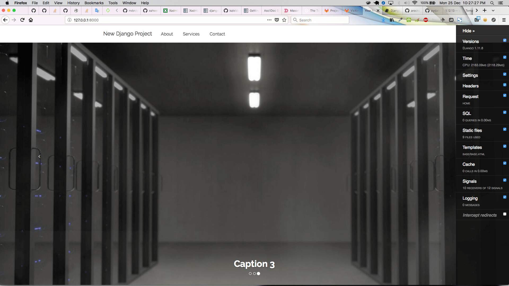

= cookiecutter-django-vix

:icons: font
:toc: left
:sectnums:

image::https://img.shields.io/badge/python-2.7-brightgreen.svg[Python 2.7]

This is my initial attempt at creating a reusable https://docs.djangoproject.com/en/1.11/releases/[Django 1.11.x] project skeleton using https://github.com/audreyr/cookiecutter[cookiecutter]. This cookiecutter template is mostly a reflection of my personal preferences. It does, however, try to employ best practices, for example, the https://12factor.net/[12-factor-app], https://github.com/arocks/edge/[Arun Ravindran's *Edge* project skeleton] and https://github.com/pydanny/cookiecutter-django[Daniel Greenfeld's *Cookiecutter Django* framework]. It is nowhere near perfect, and thus remains a work in progress. Contributions and suggestions for improvement are welcome.

== Feaures

=== Front End

===== package management

* https://bower.io/[Bower], using https://github.com/nvbn/django-bower[django-bower]

===== bootstrap

* Bootstrap Version 3.3.7, with the choice of styling using https://bootswatch.com/3/[Bootswatch]
* includes JQuery Version 1.12.4
* Starter Template: https://startbootstrap.com/template-overviews/full-slider/[Full Slider by Start Bootstrap]

===== icons

* Courtesy of http://fontawesome.io/[FontAwesome Version 4.7.0]

===== mathematical equations

* https://www.mathjax.org/[MathJax], using https://github.com/kaleidos/django-mathjax[Django-MathJax]

===== images

* https://pixabay.com/en/coffee-cup-coffee-cup-food-photo-2608864/[1^st^ Slide Image -- `00001.jpg`]
* https://pixabay.com/en/computer-computers-1245714/[2^nd^ Slide Image -- `00002.jpg`]
* https://pixabay.com/en/server-space-the-server-room-dark-2160321/[3^rd^ Slide Image -- `00003.jpg`]

===== charts

* http://gionkunz.github.io/chartist-js/[Chartist.js] is included through django-bower.

===== other libraries

* https://masonry.desandro.com/[Masonry.js] -- a JavaScript grid layout library. It works by placing elements in optimal position based on available vertical space, sort of like a mason fitting stones in a wall. You’ve probably seen it in use all over the Internet.
* http://github.hubspot.com/sortable/docs/welcome/[Sortable.js] -- Drop-in script to make your tables sortable.

=== Error Pages

===== custom 404 and 500 pages

* Easy to use, professional error pages to replace the plaintext error pages that come with any server software like Nginx or Apache. Courtesy of https://github.com/alexphelps/server-error-pages[Alex Phelps].

===== custom nginx error pages

* Courtesy of https://github.com/alexphelps/server-error-pages[Alex Phelps] (same as above ☝️) and https://github.com/AndiDittrich/HttpErrorPages[Andi Dittrich].

=== Back end

===== settings management

* https://github.com/joke2k/django-environ[django-environ] -- allows you to utilize https://12factor.net/[12factor] inspired environment variables to configure your Django application.

===== custom scripts

* https://github.com/engineervix/cookiecutter-django-vix/blob/master/%7B%7Bcookiecutter.project_slug%7D%7D/src/initialize_db.sh[`initialize_db.sh`] -- deletes all migrations and `.pyc` files, recreates SQLite, Postgres / PostGIS database, recreates migrations, superuser and basically lets you _start afresh_.
* https://github.com/engineervix/cookiecutter-django-vix/blob/master/%7B%7Bcookiecutter.project_slug%7D%7D/bckp/db/syncdb.sh[`syncdb.sh`] -- for backing up and restoring Postgres / PostGIS database

=== admin

* Experimenting with https://github.com/sshwsfc/xadmin[XAdmin] -- a drop-in replacement of the default Django Admin. Other alternatives are http://djangosuit.com/[DjangoSuit] and http://jet.geex-arts.com/[Django-Jet], both of which are only free for personal / non-commercial / open source projects. For commercial use, you need to purchase commercial licenses. See http://djangosuit.com/pricing/ and http://jet.geex-arts.com/prices for pricing information.

=== Other

* https://github.com/django-crispy-forms/django-crispy-forms[Crispy Forms]
* https://github.com/jazzband/django-debug-toolbar[django-debug-toolbar] for use during development
* https://github.com/etianen/django-reversion[djang-reversion] -- an extension to the Django web framework that provides version control for model instances.
* https://github.com/django-extensions/django-extensions[django-extensions] -- global custom management extensions for the Django Framework. I especially like https://django-extensions.readthedocs.io/en/latest/runserver_plus.html[`runserver_plus`] - the standard runserver stuff but with the Werkzeug debugger baked in. Requires http://werkzeug.pocoo.org/[Werkzeug].
* https://github.com/praekelt/django-recaptcha[django-recaptcha]
* https://github.com/alsoicode/django-maintenancemode-2[django-maintenancemode-2] -- makes it easy to put your Django site into "maintenance mode", or more technically, return an HTTP 503 response. This project differs slightly from other implementations in that the maintenance mode flag is stored in your database versus settings or an environment variable. If your site is deployed to multiple servers, the centralized database-based maintenance flag makes it a snap to bring them all up or down at once.
* Option to use https://www.sparkpost.com/[Sparkpost] as email backend for production use, via the https://github.com/SparkPost/python-sparkpost[python sparkpost client]

=== Bible Cross-Referencing Options (Not implemented, only documented for reference)

* https://www.logos.com/reftagger[RefTagger] -- this service was down on 2017-Dec-24-Sun.
* https://www.biblegateway.com/share/tooltips/
* https://www.blueletterbible.org/webtools/BLB_ScriptTagger.cfm

== To Do

* [ ] Tests, Code Coverage, CI
* [ ] Port this to Python 3
* [ ] add settings for nginx
* [ ] add settings for uwsgi
* [ ] create reusable components such as an *about page* complete with _contact forms_, _location map integration_ using http://leafletjs.com/[leaflet.js]
* [ ] signup/login with social network integration
* [ ] logging via https://sentry.io/welcome/[sentry] or similar
* [ ] caching via https://memcached.org/[Memcached]
* [ ] Analytics, SEO

== Setup

=== First, Check that All Dependencies are Met

* GNU/Linux, Mac OS X or other unix-like environment with the following packages installed:
** https://bower.io/[Bower] -- A package manager for the web. Bower depends on https://nodejs.org/[Node.js] and https://npmjs.org/[npm]. If you scroll down, you'll see that I've included some links on how to setup `Node.js` and `npm` on Ubuntu. Also make sure that https://git-scm.com/[git] is installed as some bower packages require it to be fetched and installed.
** https://www.postgresql.org/[postresql] -- if you're using a PostgeSQL database. For installation, please refer to https://wiki.postgresql.org/wiki/Detailed_installation_guides[these instructions] or your OS-specific installation instructions.
** https://postgis.net/[postgis] -- if you're using a PostgGIS database. For installation, please refer to http://postgis.net/install/[these instructions] or your OS-specific installation instructions.
** `libjpeg`, `zlib` http://pillow.readthedocs.io/en/3.0.x/installation.html[and other libraries] that may be required by https://github.com/python-pillow/Pillow[Pillow -- A friendly fork of The Python Imaging Library (PIL)]
** I'm assuming your system is already setup for bare-minimum development. If for example, you're using Ubuntu or another Debian-based GNU/Linux distribution, feel free to check out the following links:
*** https://www.digitalocean.com/community/tutorials/how-to-install-nginx-on-ubuntu-16-04
*** https://www.digitalocean.com/community/tutorials/how-to-serve-django-applications-with-uwsgi-and-nginx-on-ubuntu-16-04
*** https://developer.mozilla.org/en-US/docs/Learn/Server-side/Django/development_environment
*** http://www.openbookproject.net/books/bpp4awd/app_a.html
*** https://www.fullstackpython.com/ubuntu.html
*** http://chrisstrelioff.ws/sandbox/2016/09/21/python_setup_on_ubuntu_16_04.html
*** https://www.digitalocean.com/community/tutorials/how-to-install-node-js-on-ubuntu-16-04
*** https://www.digitalocean.com/community/tutorials/how-to-set-up-a-node-js-application-for-production-on-ubuntu-16-04
*** https://developer.mozilla.org/en-US/docs/Learn/Server-side/Express_Nodejs/development_environment
*** https://itsfoss.com/install-nodejs-ubuntu/

[NOTE]
====
If using Ubuntu, install postgres and postgis as follows

----
sudo apt-get install postgresql postgresql-contrib postgis
----
====

* Python 2.7 (not tested on Python 3) with the following packages:
** https://virtualenvwrapper.readthedocs.io/en/latest/[virtualenvwrapper]
** https://github.com/audreyr/cookiecutter[cookiecutter]
** https://uwsgi-docs.readthedocs.io/en/latest/[uwsgi]

=== Install

----
cookiecutter https://github.com/engineervix/cookiecutter-django-vix
----

You'll be prompted for some values. Provide them, then a Django project will be created for you. *Warning*: Ensure that you change 'Victor Miti', 'example.com', etc. to your own information.

----
cd {{ cookiecutter.project_slug }}
mkvirtualenv -p python2 {{ cookiecutter.project_slug }}
pip install -r requirements.txt

# If you wanna use postgres or postgis, please setup your database
# as per your respective DB client. Here's an example for the CLI:
psql
# On the psql console, enter the following, replacing DB_User with
# your desired DB Name, and DB_User with desired DB Username.
# Do the same for your_password -- replace it with your password
# If you ain't using PostGIS, ignore the lines befinning from
# `ALTER ROLE DB_User SUPERUSER;` to `ALTER ROLE DB_User NOSUPERUSER;`

# CREATE USER DB_User PASSWORD 'your_password';
# CREATE DATABASE DB_Name OWNER DB_User;
# GRANT ALL PRIVILEGES ON DATABASE DB_Name to DB_User;
# ALTER ROLE DB_User SUPERUSER;
# \c DB_Name;
# CREATE EXTENSION postgis;
# CREATE EXTENSION postgis_topology;
# \q
# -------- Later ... After Django Does its business: --------
# \c DB_Name
# ALTER ROLE DB_User NOSUPERUSER;
# \q

# run the initialize_db.sh script, ensuring that you provide
# the DB_Name and DB_User as arguments to the script
# if you're using SQLite, keep the DB_Name as 0 and DB_User
# as 0 as shown below.
# Otherwise, replace those 0s with appropriate values based on the
# database you created earlier

cd src
chmod +x initialize_db.sh
./initialize_db.sh -n 0 -u 0

# You'll be prompted for some values. Provide them,
# Django will create initial migrations and create a superuser.

# Next, Let Bower install the required packages
chmod +x manage.py && ./manage.py bower install

# Then, we need to `collectstatic`
./manage.py collectstatic

# Done, let's run the project and start buiding something awesome!
./manage.py runserver_plus
----

If all went well, you should see the following if you point your browser to `127.0.0.1:8000`

